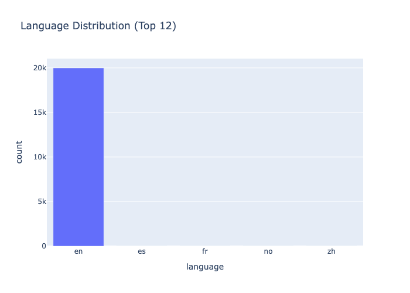
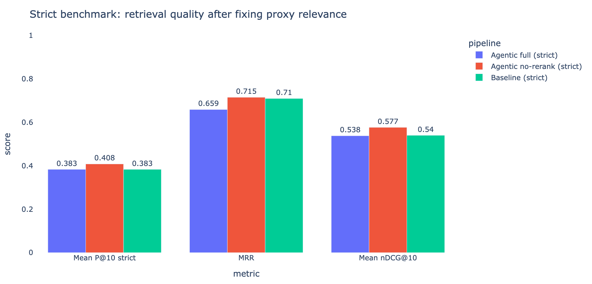
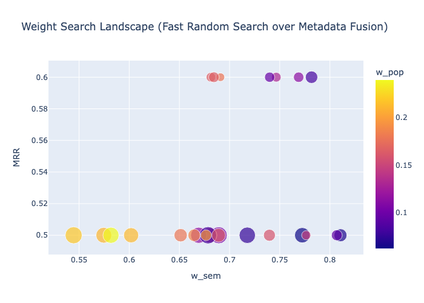

# PromptKaban Semantic Search

This project is our LEAF x LUISS AI Techniques submission. We built a semantic
search pipeline for PromptKaban: given a natural-language query, the system
returns the most relevant prompts from a dataset of about 20,000 prompt records.

The main problem is that keyword search is not enough. Users often describe the
same intent with different words, so we combine embeddings, vector retrieval,
reranking, and metadata-aware scoring.

## Team

| Student | Matricola |
|---|---:|
| Alice Rossi | 305091 |
| Alisa Lamina | 321961 |
| Andrea Cipolla | 319211 |
| Maiia Kopalina | 321891 |

**Academic Year:** 2025/2026  
**Grade:** 29/30

## What To Run

The recommended entry point is the notebook:

```bash
cd ..
pip install -r requirements.txt
jupyter notebook main.ipynb
```

Run `main.ipynb` from the repository root. The notebook executes the Python
modules in the correct order and keeps the explanations, tables, and plots in
one place.

The `.py` files in `src/` are the same pipeline split by component role, as
required by the project rules. They can also be run directly.

From the repository root:

```bash
python src/5_pipeline.py
python src/7_evaluation.py
```

Optional demo:

```bash
streamlit run src/app.py
```

## Required Data

The LEAF dataset must be available at:

```text
LEAF-promptkaban-dataset/
├── dataset.json
└── FIELDS.md
```

All commands should be run from the repository root so that relative paths work
correctly.

## Architecture

```text
Query
  -> prompt/query embeddings
  -> FAISS vector index
  -> cosine similarity retrieval
  -> cross-encoder reranking
  -> metadata-aware final score
  -> ranked prompt results
```

The implementation follows the four mandatory steps from the brief:

| PDF step | What we implemented | Main file |
|---|---|---|
| Step 1: Embeddings | Build `semantic_text` and encode prompts with sentence-transformer models. | `2_embeddings.py` |
| Step 2: Vector Database | Store normalized vectors in a FAISS `IndexFlatIP` index. A sklearn fallback is available. | `2_embeddings.py` |
| Step 3: Cosine Similarity | Embed the query and retrieve top-K candidates by normalized inner product, equivalent to cosine similarity. | `3_retrieval.py` |
| Step 4: Reranker | Rerank candidates with `cross-encoder/ms-marco-MiniLM-L-6-v2`. | `4_reranking.py` |

We also added bonus components: BM25 hybrid retrieval, metadata-aware ranking,
MMR diversification, query rewriting, Reciprocal Rank Fusion, 200-query silver
evaluation, human audit, and a small reranker fine-tune experiment.

## How The Python Files Work

The source code is split into seven numbered files so the execution order is
clear. This follows the project requirement that the `src` folder should contain
multiple Python files ordered by their role. Each file is self-contained, has a
header comment describing its role, and contains the working code suggested by
its filename.

| Order | File | What it does | Why it matters |
|---:|---|---|---|
| 1 | `1_preprocessing.py` | Loads `dataset.json`, validates fields, explores metadata, builds `semantic_text`, and tokenizes text for BM25. | This creates the clean working dataframe used by every later step. |
| 2 | `2_embeddings.py` | Loads embedding models, generates prompt vectors, caches `.npy` embeddings, and builds the FAISS/sklearn vector index. | This is the core of semantic retrieval: prompts become searchable vectors. |
| 3 | `3_retrieval.py` | Implements dense cosine retrieval, BM25 lexical retrieval, and hybrid fusion. | Dense search captures meaning; BM25 helps when exact words still matter. |
| 4 | `4_reranking.py` | Uses the cross-encoder reranker, then blends semantic score with popularity, quality, and freshness metadata. | The first retrieval step finds candidates; reranking improves their order. |
| 5 | `5_pipeline.py` | Connects preprocessing, retrieval, reranking, metadata scoring, MMR, and latency measurement into `search_pipeline()`. | This is the main end-to-end search function used by the demo and evaluation. |
| 6 | `6_query_rewriter.py` | Adds optional query rewriting, multi-query retrieval, and Reciprocal Rank Fusion. | This tests an agentic variant for ambiguous or underspecified queries. |
| 7 | `7_evaluation.py` | Runs metrics, model comparison, strict/silver benchmarks, human-audit summaries, and fine-tune reporting. | This is where we measure whether the search pipeline actually improves. |

Each numbered file has a header comment explaining its role and expected
outputs. Later files automatically load earlier steps when needed.

The code files are kept clean: there are no long commented-out code sections,
and comments are used only where they clarify the role of a block or a design
choice.

## Models Used

| Role | Model |
|---|---|
| Default embeddings | `sentence-transformers/all-MiniLM-L6-v2` |
| Compared embeddings | `BAAI/bge-small-en-v1.5`, `intfloat/e5-small-v2` |
| Reranker | `cross-encoder/ms-marco-MiniLM-L-6-v2` |
| Optional query rewriter | Ollama `llama3`, HF `google/flan-t5-base`, heuristic fallback |

## Environment And Libraries

Python version used for the submitted environment:

```text
Python 3.12.2
```

The full dependency list with versions is in:

```text
requirements.txt
```

Main libraries:

| Library | Version |
|---|---:|
| `pandas` | 3.0.3 |
| `numpy` | 2.4.4 |
| `scikit-learn` | 1.8.0 |
| `plotly` | 6.7.0 |
| `kaleido` | 1.3.0 |
| `tqdm` | 4.67.3 |
| `sentence-transformers` | 5.4.1 |
| `rank-bm25` | 0.2.2 |
| `faiss-cpu` | 1.13.2 |
| `streamlit` | 1.57.0 |
| `transformers` | 5.8.0 |
| `torch` | 2.11.0 |
| `requests` | 2.34.0 |
| `ipywidgets` | 8.1.8 |
| `pyarrow` | >=15.0.0 |

## Local Hardware Constraints

During development we had significant difficulties with heavier local models,
especially Ollama-based query rewriting. On our laptops, these models could be
slow, memory-heavy, or unstable during long notebook runs.

For that reason, the project is written defensively:

- it checks the available device before loading models (`CUDA`, Apple `MPS`, or
  CPU);
- it uses lightweight embedding and reranking models by default;
- it caches embeddings on disk so expensive steps do not need to be repeated;
- it keeps fallback paths, such as the sklearn vector-search fallback and the
  heuristic query rewriter, so the core search pipeline can still run on weaker
  machines.

This is also why some notebook cells print device information and why we paid
attention to memory usage during the experiments.

## Results

We report automatic/silver results separately from the manual human audit,
because they measure different things.

### 200-query silver benchmark

This benchmark uses a larger automatically labelled evaluation set. It is useful
for comparing pipelines at scale, but it is not the same as human relevance.

| Pipeline | Mean P@10 | Mean P@10 strict | MRR | Mean nDCG@10 | Avg latency |
|---|---:|---:|---:|---:|---:|
| Agentic full | **0.797** | **0.612** | 0.887 | **0.667** | ~9.37 s |
| Agentic no-rerank | 0.706 | 0.275 | **0.941** | 0.443 | ~4.16 s |
| Baseline | 0.610 | 0.343 | 0.779 | 0.431 | ~4.65 s |

In this silver benchmark, the full agentic pipeline has the best overall
retrieval quality, while the no-rerank variant gives the best MRR and lower
latency.

### Manual human audit

We also manually checked 200 returned results across 20 queries. The manual
audit is stricter because it asks whether a person would actually consider each
prompt useful.

| Manual relevance rule | Human Precision@10 |
|---|---:|
| `human_grade >= 1` (partial or full relevance) | 0.645 |
| `human_grade == 2` (full relevance only) | 0.355 |

This is why the automatic numbers and manual numbers should not be compared as
if they were the same metric. The automatic benchmark measures retrieval
coverage; the human audit measures perceived usefulness.

### Reranker fine-tune check

We also tested a small in-notebook reranker fine-tune using the manual labels:

| Stage | Holdout RMSE |
|---|---:|
| Before fine-tune | 0.481 |
| After fine-tune | 0.449 |

The fine-tuned reranker slightly improves agreement with the manual labels, but
the dataset is still small, so we treat this as an experiment rather than the
main production result.

## Important Figures

The notebook contains the generated plots. Exported PNG copies are included in:

```text
assets/
```

Important figures:

**Dataset overview — top prompt categories**


**Dataset overview — language distribution**



**Semantic map — PCA projection of prompt embeddings**


**Embedding model comparison**


**Strict pipeline benchmark**



**Metadata weight search**



**Demo example — score components for a search result**


## Runtime

A clean run in a temporary project copy, without embedding `.npy` caches, took:

```text
815.13 seconds, about 13 minutes 35 seconds
```

A warm run with cached embeddings and models takes about 6 minutes on the local
machine.
